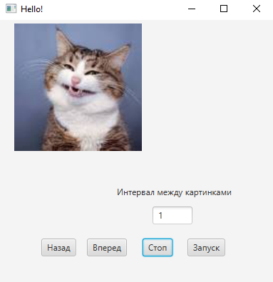
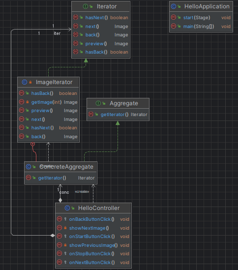

# Iterator
**Описание:** В данном репозитории представлена программа *Iterator*.

**Скриншот рабочего окна приложения:**

## Архитектура
**Скриншот диаграммы классов:**

## Зависимости
Язык программироваия **Java**, комплект разработчика приложений **JDK 21**, а также **JavaFX**.

## Применение
Для использования данной программы вам необходимо:
* Изменить на свои картинки в папке src/main/resources
* Задать скорость изменения картинок;
* Нажать на кнопку *Старт*;
* По необходимости нажать на кнопку *Стоп*;
* При необходимости перелистывать изображения с помощью кнопок *Вперед* и *Назад*;
